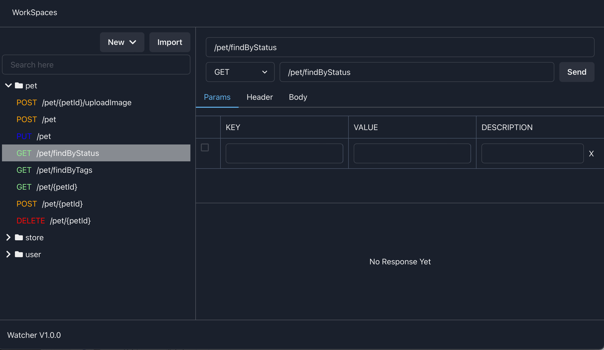

<b>Watcher</b>, API manager built for a easier use to manage and collaborate.

  

---

# What is Watcher?

An API manager built for a easier use to manage and collaborate on API calls. It is also a cross-platform application powered by the web that is being wrapped using [Tauri](https://tauri.studio) framework in which you can run Watcher on Windows, MacOS, or Linux without having much trouble. Some Watcher's features/roadmap in summary are:

- [x] Making Request (Of course!)
- [x] Directory Management
- [x] Workspace switch
- [x] Import from swagger
- [x] Import from postman
- [x] Environment Variables Feature
- [x] Sync/Share Feature (From [supabase](https://supabase.io/))
- [ ] Sync From more places!
- [ ] Import from more places!
- [ ] Pre/Post request script
- [ ] Tab Feature
- [ ] Flow Management

Watcher is currently under heavy development. You can give your suggestions and feedback on our Discussions page. If you feel comfortable in writing code using Typescript and Rust, we highly encourage you to contribute to this project.

## Installation

If you want to install Watcher on your system, you can download the installer for your operating system [on the release page](https://github.com/windht/watcher/releases). Please note that the current version is not stable yet, and you may encounter various bugs.

## Tech Stack

- React
- Chakra UI
- Mobx
- Tauri

## Development

If you want to run this project in your local system, please follow this guide:

0. We use `yarn` to manage package and run scripts.

1. Run `yarn install` to install dependencies.

2. Run `yarn start` to start the react app running on port 3000 by default.

3. Follow [this guide](https://tauri.studio/en/docs/getting-started/intro/#setting-up-your-environment) to set up Tauri environment

4. Run `yarn tauri dev`
